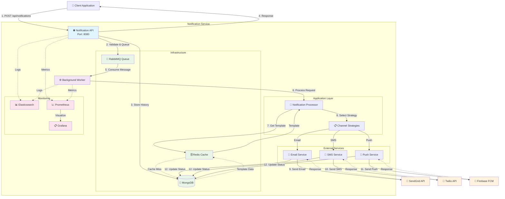

# Notification Service - System Flow Diagram

## 🔄 **SƠ ĐỒ LUỒNG HOẠT ĐỘNG CỦA HỆ THỐNG**

### **Tổng quan kiến trúc**
Hệ thống Notification Service được xây dựng theo mô hình microservice với Clean Architecture, bao gồm các thành phần chính sau:

### **Mermaid Diagram**

## 📋 **CHI TIẾT LUỒNG HOẠT ĐỘNG**

### **Bước 1: Tiếp nhận yêu cầu**
- Client gửi HTTP POST request đến `/api/notifications`
- API Controller validate dữ liệu đầu vào
- Kiểm tra các trường bắt buộc theo từng channel

### **Bước 2: Xử lý và lưu trữ**
- Tạo `NotificationRequest` entity
- Publish message vào RabbitMQ queue
- Lưu `NotificationHistory` vào MongoDB
- Trả về response với notification ID

### **Bước 3: Xử lý bất đồng bộ**
- Background Worker consume message từ queue
- `NotificationProcessor` xử lý business logic
- Load template từ Redis cache (hoặc MongoDB nếu cache miss)

### **Bước 4: Gửi thông báo**
- Chọn strategy phù hợp (Email/SMS/Push)
- Gọi external service tương ứng
- Nhận response và xử lý kết quả

### **Bước 5: Cập nhật trạng thái**
- Update `NotificationHistory` với kết quả
- Ghi logs và metrics
- Xử lý retry nếu gửi thất bại

## 🏗️ **KIẾN TRÚC LAYERS**

### **1. API Layer**
- **Responsibility**: Tiếp nhận HTTP requests, validation, response
- **Components**: Controllers, DTOs, Swagger
- **Port**: 8080

### **2. Application Layer**
- **Responsibility**: Business logic, orchestration
- **Components**: Services, Interfaces, Processors
- **Key Class**: `NotificationProcessor`

### **3. Domain Layer**
- **Responsibility**: Core business entities và rules
- **Components**: Entities, Enums, Value Objects
- **Key Entities**: `NotificationRequest`, `NotificationHistory`, `NotificationTemplate`

### **4. Infrastructure Layer**
- **Responsibility**: External integrations, data access
- **Components**: Repositories, External Services, Messaging
- **Key Services**: MongoDB, Redis, RabbitMQ, SendGrid, Twilio, Firebase

## 🔄 **PATTERN VÀ PRINCIPLES ÁP DỤNG**

### **Design Patterns**
1. **Strategy Pattern**: Channel selection (Email/SMS/Push)
2. **Repository Pattern**: Data access abstraction
3. **Decorator Pattern**: Cached repository wrapper
4. **Factory Pattern**: Notification channel factory
5. **Publisher-Subscriber**: RabbitMQ messaging

### **SOLID Principles**
- **S**ingle Responsibility: Mỗi class có một trách nhiệm duy nhất
- **O**pen/Closed: Mở rộng qua interfaces, đóng với modification
- **L**iskov Substitution: Implementations có thể thay thế interfaces
- **I**nterface Segregation: Interfaces nhỏ và focused
- **D**ependency Inversion: Phụ thuộc vào abstractions

## 📊 **MONITORING VÀ OBSERVABILITY**

### **Logging Stack**
- **Serilog**: Structured logging trong application
- **Elasticsearch**: Centralized log storage
- **Kibana**: Log analysis và visualization

### **Metrics Stack**
- **Prometheus**: Metrics collection
- **Grafana**: Metrics visualization và dashboards
- **Health Checks**: Application health monitoring

### **Key Metrics**
- Request rate và response time
- Queue depth và processing time
- Success/failure rates per channel
- External service response times
- Cache hit/miss ratios

## 🚀 **SCALABILITY VÀ RELIABILITY**

### **Horizontal Scaling**
- API instances có thể scale independently
- Worker instances có thể scale based on queue depth
- Database sharding support

### **Fault Tolerance**
- Exponential backoff retry mechanism
- Dead letter queue cho failed messages
- Circuit breaker pattern (planned)
- Graceful degradation

### **Performance Optimization**
- Redis caching cho templates
- Connection pooling (planned)
- Async processing với message queue
- Database indexing

---

**📝 Note**: Sơ đồ này mô tả luồng hoạt động hiện tại của hệ thống. Các tính năng đang được phát triển sẽ được cập nhật trong phiên bản tiếp theo.

**📅 Last Updated**: September 17, 2025
